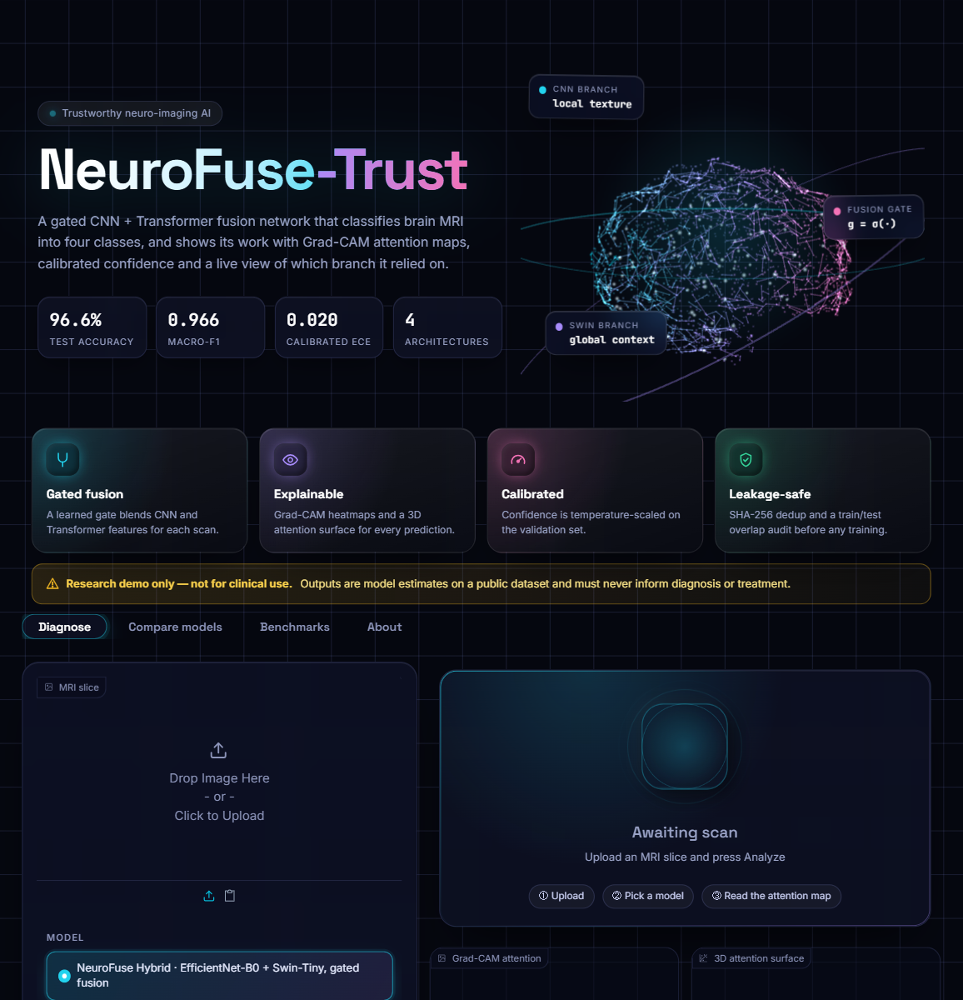

<div align="center">


<br/>

[](https://www.python.org/)
[](https://pytorch.org/)
[](https://github.com/huggingface/pytorch-image-models)
[](https://www.gradio.app/)
[](LICENSE)

**Gated CNN + Transformer fusion for 4-class brain MRI classification,<br/>with Grad-CAM explanations, calibrated confidence and a leakage-audited dataset.**

[Quick start](#-quick-start) · [Results](#-results) · [Architecture](#-architecture) · [Demo app](#-the-demo-app) · [Reproduce](#-reproduce-training) · [Limitations](#%EF%B8%8F-limitations)

</div>

> [!CAUTION]
> **Research demo only — not for clinical use.** NeuroFuse-Trust is an academic project. Its outputs must never inform diagnosis, treatment or any patient-care decision.

---

## ✨ Highlights

<table>
<tr>
<td width="25%" valign="top">

### 🧬 Gated fusion
EfficientNet-B0 (local texture) and Swin-Tiny (global context) run in parallel. A learned sigmoid gate blends the two feature vectors separately for every scan.

</td>
<td width="25%" valign="top">

### 🔍 Explainable
Every prediction comes with a Grad-CAM overlay, an interactive **3D attention surface**, and the gate value showing how much the decision relied on each branch.

</td>
<td width="25%" valign="top">

### 🎯 Calibrated
Temperature scaling is fit on the validation set. The demo shows either raw or calibrated confidence, and ECE is reported before and after.

</td>
<td width="25%" valign="top">

### 🛡️ Leakage-safe
Every image is SHA-256 hashed. The audit removed **938** exact duplicates and **234** images that appeared in both train and test before training started.

</td>
</tr>
</table>

## 🏆 Results

Held-out test set: **2,358 images** that no model saw during training or checkpoint selection.

| Model | Role | Accuracy | Macro-F1 | ECE (raw) | ECE (temp-scaled) |
|:--|:--|:-:|:-:|:-:|:-:|
| **NeuroFuse Hybrid** | **Gated fusion (ours)** | **96.61%** | **0.9665** | 0.0234 | **0.0197** |
| EfficientNet-B0 | CNN baseline | 95.72% | 0.9585 | 0.0233 | 0.0232 |
| CoAtNet-0 | Off-the-shelf hybrid | 95.59% | 0.9568 | **0.0161** | 0.0199 |
| Swin-Tiny | Transformer baseline | 94.49% | 0.9448 | 0.0246 | 0.0266 |

<details>
<summary><b>Per-class recall</b></summary>

| Model | Glioma | Meningioma | No tumor | Pituitary |
|:--|:-:|:-:|:-:|:-:|
| NeuroFuse Hybrid | 0.946 | **0.942** | 0.998 | 0.988 |
| EfficientNet-B0 | 0.943 | 0.913 | **1.000** | 0.982 |
| CoAtNet-0 | 0.905 | 0.954 | 0.998 | **0.990** |
| Swin-Tiny | **0.948** | 0.861 | 0.991 | 0.980 |

</details>

The hybrid beats both single-architecture baselines and the off-the-shelf CoAtNet hybrid on accuracy and macro-F1. After temperature scaling it also has the lowest calibration error.

<p align="center">
  
</p>

<details>
<summary><b>Training curves, Grad-CAM overlays and reliability diagrams</b></summary>

<p align="center"></p>
<p align="center"></p>
<p align="center"></p>

</details>

## 🧠 Architecture

<p align="center">
  
</p>

```text
f_cnn = Linear(EfficientNet-B0(x))        # 1280 → 256
f_tf  = Linear(Swin-Tiny(x))              #  768 → 256
g     = σ( MLP([f_cnn ; f_tf]) )          # per-dimension gate in (0, 1)
fused = g · f_cnn + (1 − g) · f_tf
logits = Linear(LayerNorm(fused))         # 4 classes
```

The backbones are fine-tuned at a lower learning rate (5e-5) than the fusion head (2e-4). Training uses AMP, AdamW and class-weighted cross-entropy.

## 🖥️ The demo app

A dark, glassmorphism Gradio interface with a live Three.js neural-network hero. It has four tabs:

| Tab | What it does |
|:--|:--|
| **Diagnose** | Upload a slice, pick a model and get the predicted class, a confidence ring, the fusion-gate split, a Grad-CAM overlay, a 3D attention surface and the class probabilities |
| **Compare models** | Runs all four architectures on the same slice, reports whether they agree, and shows their Grad-CAM maps side by side |
| **Benchmarks** | Leaderboard, dataset-audit KPIs, interactive accuracy / recall / calibration / faithfulness charts and training curves |
| **About** | Animated architecture diagram, class atlas and method notes |

<p align="center">
  
  
</p>
<p align="center">
  
  
</p>
<p align="center">
  
</p>

## 🚀 Quick start

```bash
git clone https://github.com/Sandeepsrinivasan-14/neurofuse-trust.git
cd neurofuse-trust

# 1. Install PyTorch for your platform first: https://pytorch.org/get-started/locally/
pip install -r requirements.txt

# 2. Download the trained weights (~346 MB, from the GitHub Release)
python -m neurofuse.weights            # all four models
python -m neurofuse.weights hybrid     # or just one

# 3. Launch the demo
python app.py                          # http://127.0.0.1:7860
python app.py --share                  # public Gradio link
```

The app also downloads missing weights automatically the first time it runs. It works on CPU, and a CUDA GPU is used when one is available.

### Model weights

| Model | File | Size |
|:--|:--|--:|
| NeuroFuse Hybrid | [`hybrid.pt`](https://github.com/Sandeepsrinivasan-14/neurofuse-trust/releases/download/v1.0.0/hybrid.pt) | 123 MB |
| CoAtNet-0 | [`coatnet.pt`](https://github.com/Sandeepsrinivasan-14/neurofuse-trust/releases/download/v1.0.0/coatnet.pt) | 102 MB |
| Swin-Tiny | [`swin.pt`](https://github.com/Sandeepsrinivasan-14/neurofuse-trust/releases/download/v1.0.0/swin.pt) | 105 MB |
| EfficientNet-B0 | [`effnet.pt`](https://github.com/Sandeepsrinivasan-14/neurofuse-trust/releases/download/v1.0.0/effnet.pt) | 16 MB |

Each file is a plain `state_dict` and goes in `outputs/checkpoints/<model>/best.pt`.

### Use it from Python

```python
from PIL import Image
from neurofuse.inference import predict

pred = predict(Image.open("assets/examples/glioma_1.jpg"), "hybrid")
print(pred.label, pred.dist(calibrated=True), pred.gate)
# pred.overlay → RGB Grad-CAM overlay (numpy), pred.cam → 224×224 attention map
```

## 🔬 Reproduce training

The whole pipeline (data audit, training, evaluation, Grad-CAM, calibration) is one notebook, [`NeuroFuse_Trust.ipynb`](NeuroFuse_Trust.ipynb). It is generated from the jupytext source [`NeuroFuse_Trust.py`](NeuroFuse_Trust.py).

1. Get the **Brain Tumor MRI Dataset** (Epic & CSCR hospital, 4 classes) and extract it to:
   ```
   data/raw/Epic and CSCR hospital Dataset/{Train,Test}/{glioma,meningioma,notumor,pituitary}/*.jpg
   ```
2. Build and run the notebook:
   ```bash
   python -m jupytext --to ipynb NeuroFuse_Trust.py
   jupyter nbconvert --to notebook --execute --inplace NeuroFuse_Trust.ipynb --ExecutePreprocessor.timeout=10800
   ```

Set `DEBUG = True` at the top of the notebook for a 1-epoch smoke test on a small subset. Checkpoints are written every epoch and training resumes from `last.pt` automatically. All four models were trained on a **4 GB RTX 3050 laptop GPU**.

| Setting | Value |
|:--|:--|
| Input | 224 × 224, ImageNet normalisation |
| Augmentation | horizontal flip, ±10° rotation, brightness/contrast jitter |
| Split | SHA-256 dedup → train/test overlap removed → stratified 15 % validation split (seed 42) |
| Sizes | 7,256 train · 1,278 val · 2,358 test |
| Selection | best epoch by validation macro-F1 |

The split files (`data/splits/*.csv`) and the leakage report are committed, so the exact partition can be reproduced.

## 📁 Project structure

```text
neurofuse-trust/
├── app.py                     # Gradio demo (python app.py --help)
├── neurofuse/
│   ├── models.py              # GatedFusionHybrid + model registry + Grad-CAM targets
│   ├── inference.py           # predict(): probabilities, temperature scaling, Grad-CAM, gate
│   ├── charts.py              # Plotly figures (3D attention surface, benchmarks, curves)
│   ├── weights.py             # downloads weights from the GitHub Release
│   └── ui/                    # theme, CSS, Three.js hero, HTML components
├── NeuroFuse_Trust.py         # jupytext source of the training notebook
├── NeuroFuse_Trust.ipynb      # executed notebook with outputs
├── data/splits/               # leakage-audited train/val/test CSVs + report
├── outputs/
│   ├── results/               # test metrics, calibration, faithfulness, comparison CSVs
│   ├── figures/               # notebook figures
│   └── checkpoints/           # training histories (weights via Release)
└── assets/                    # banner, architecture diagram, screenshots, sample scans
```

## ⚠️ Limitations

- **Single-source data.** The models were trained and tested on one public dataset of 2D slices, with no external or multi-centre validation.
- **The explanations are not localisation.** Grad-CAM shows which regions drove the model's output, not where the tumour is, and no clinician has checked the maps. For the hybrid, CAM is computed on the CNN branch only.
- **The faithfulness test is small and mixed.** The deletion test (masking the top 20 % of CAM pixels vs. a random 20 %) ran on 4 images. The gap (`drop_CAM − drop_random`) was positive for Swin (+0.117) and CoAtNet (+0.036), but negative for EfficientNet (−0.179) and the hybrid (−0.507). For those two models, random masking lowered confidence *more* than masking the CAM regions. Treat their heatmaps with caution.
- **Calibration is approximate.** The temperature was fit on logits reconstructed from softmax probabilities rather than on cached raw logits.
- **Not a medical device.** For research and education only.

## 🙏 Acknowledgements

Built with [PyTorch](https://pytorch.org/), [timm](https://github.com/huggingface/pytorch-image-models), [pytorch-grad-cam](https://github.com/jacobgil/pytorch-grad-cam), [Gradio](https://www.gradio.app/), [Plotly](https://plotly.com/python/) and [Three.js](https://threejs.org/).

## 📄 License

Code is released under the [MIT License](LICENSE). The dataset is not redistributed here; follow its original license.

<div align="center">
<sub>Made by <a href="https://github.com/Sandeepsrinivasan-14">Sandeep Srinivasan S</a> · <b>Research demo only — not for clinical use.</b></sub>
</div>
