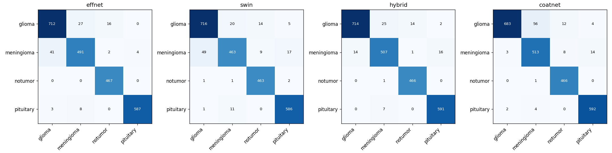
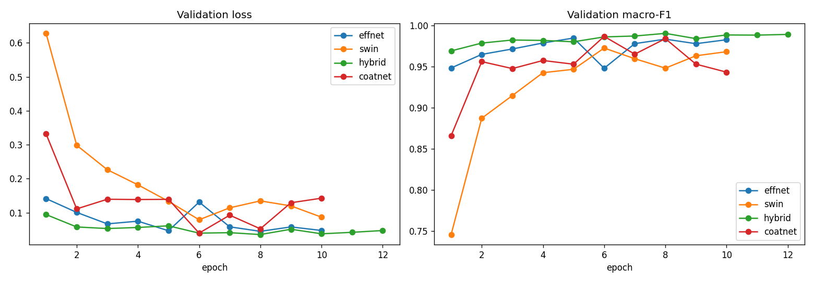
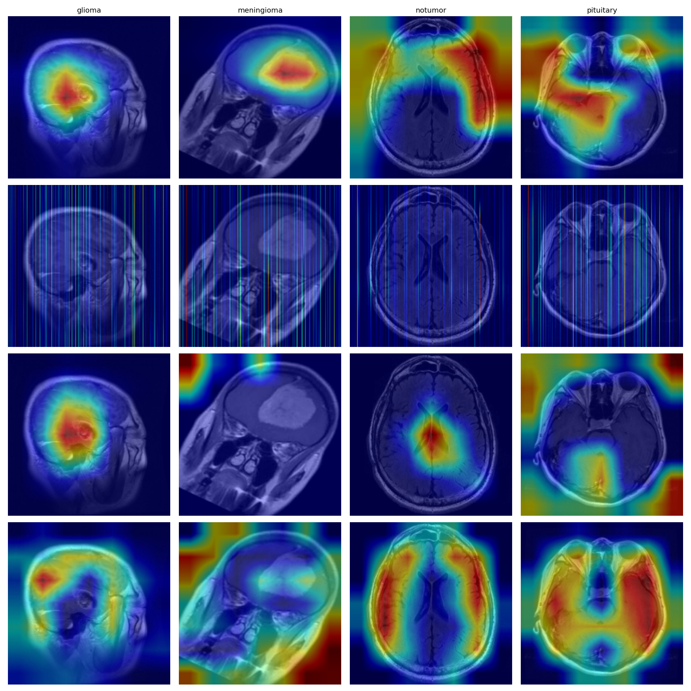
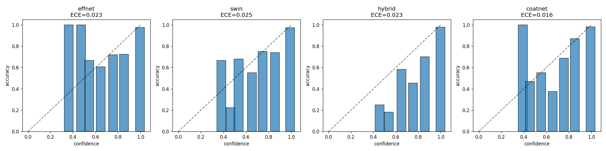
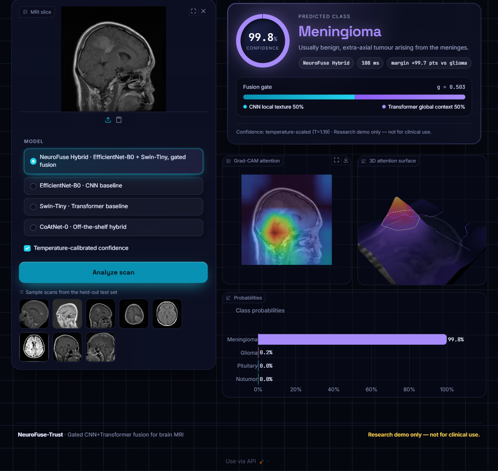
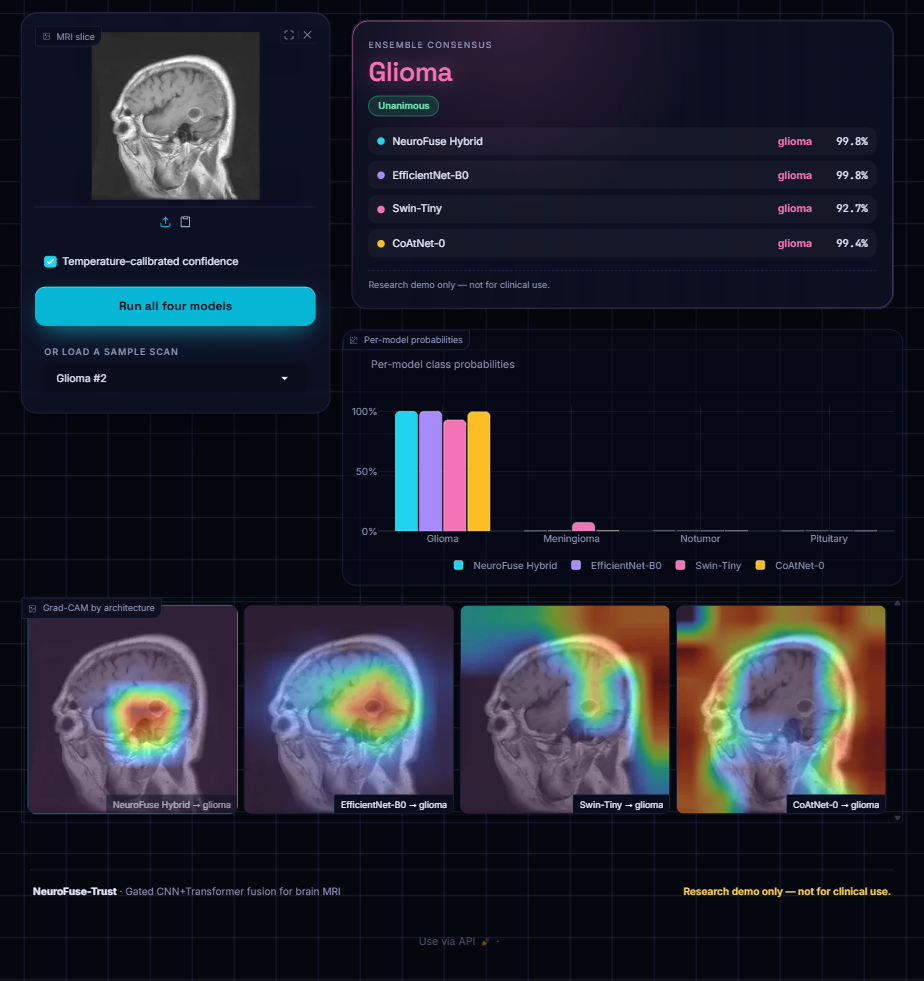
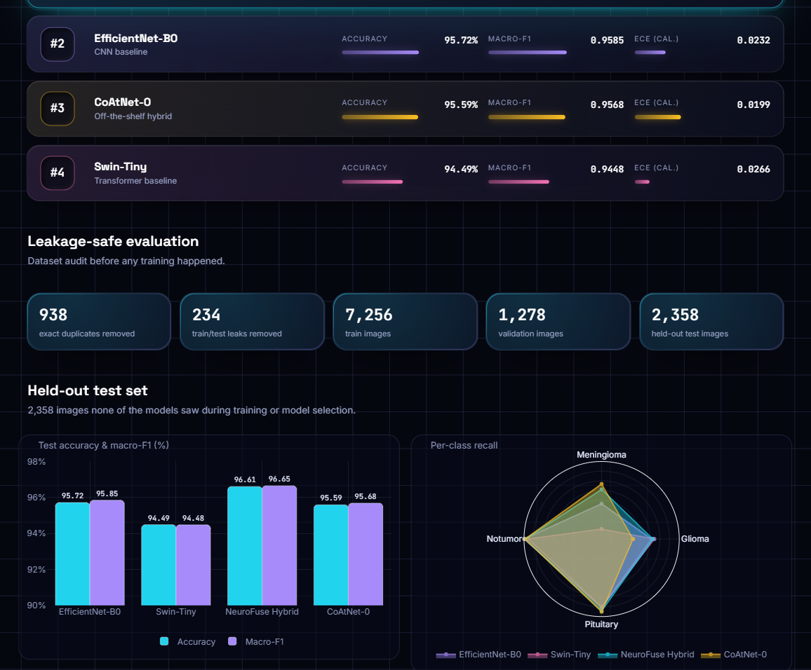
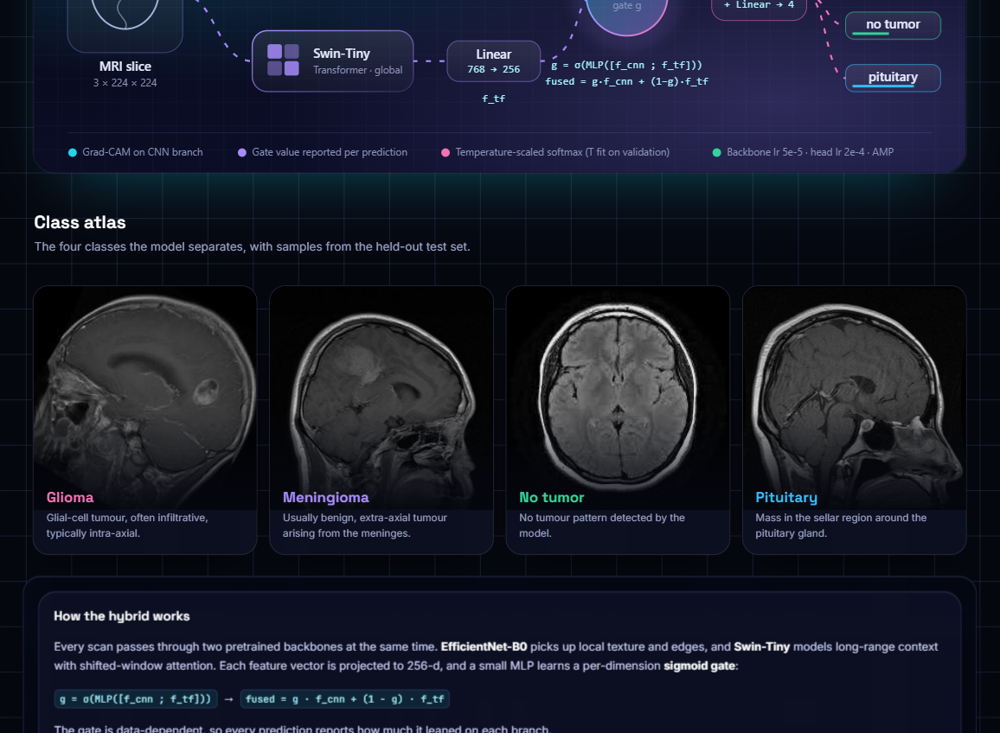

<div align="center">



[](https://www.python.org/)
[](https://pytorch.org/)
[](https://github.com/huggingface/pytorch-image-models)
[](https://www.gradio.app/)
[](LICENSE)

**Gated CNN-Transformer fusion for four-class brain MRI classification, with Grad-CAM explanations, calibrated confidence and a leakage-audited data split.**

</div>

> [!CAUTION]
> **Research demo only — not for clinical use.** NeuroFuse-Trust is an academic project. Its outputs must not inform diagnosis, treatment or any patient-care decision.

## Contents

- [Overview](#overview)
- [Results](#results)
- [Architecture](#architecture)
- [Demo application](#demo-application)
- [Installation and usage](#installation-and-usage)
- [Reproducing training](#reproducing-training)
- [Project structure](#project-structure)
- [Limitations](#limitations)
- [License](#license)

## Overview

NeuroFuse-Trust classifies axial brain MRI slices into **glioma**, **meningioma**, **pituitary tumor** or **no tumor**. The main contribution is a hybrid model that runs EfficientNet-B0 and Swin-Tiny in parallel and combines their features through a learned gate. It is compared against each backbone alone and against CoAtNet-0, an off-the-shelf hybrid.

- **Gated fusion.** A sigmoid gate weights CNN features (local texture) against Transformer features (global context) separately for each input.
- **Explainability.** Each prediction comes with a Grad-CAM map, and a deletion test checks how faithful those maps are.
- **Calibration.** Temperature scaling is fit on the validation set. Expected calibration error (ECE) is reported before and after scaling.
- **Dataset.** [Brain Tumor MRI Dataset](https://data.mendeley.com/datasets/zwr4ntf94j/1) (Mendeley Data, Epic and CSCR hospital), 12,064 T1-weighted contrast-enhanced slices.
- **Leakage audit.** Every image is SHA-256 hashed before splitting. The audit removed 938 exact duplicates and 234 images that appeared in both the training and test sets.

## Results

All results are on a held-out test set of **2,358 images**. No model saw these images during training or checkpoint selection.

| Model | Role | Accuracy | Macro-F1 | ECE (raw) | ECE (temperature-scaled) |
|:--|:--|:-:|:-:|:-:|:-:|
| **NeuroFuse Hybrid** | Gated fusion (proposed) | **96.61%** | **0.9665** | 0.0234 | **0.0197** |
| EfficientNet-B0 | CNN baseline | 95.72% | 0.9585 | 0.0233 | 0.0232 |
| CoAtNet-0 | Off-the-shelf hybrid | 95.59% | 0.9568 | **0.0161** | 0.0199 |
| Swin-Tiny | Transformer baseline | 94.49% | 0.9448 | 0.0246 | 0.0266 |

**Per-class recall**

| Model | Glioma | Meningioma | No tumor | Pituitary |
|:--|:-:|:-:|:-:|:-:|
| NeuroFuse Hybrid | 0.946 | **0.942** | 0.998 | 0.988 |
| EfficientNet-B0 | 0.943 | 0.913 | **1.000** | 0.982 |
| CoAtNet-0 | 0.905 | 0.954 | 0.998 | **0.990** |
| Swin-Tiny | **0.948** | 0.861 | 0.991 | 0.980 |

The hybrid has the highest accuracy and macro-F1 of the four models. After temperature scaling it also has the lowest calibration error.

<p align="center">
  
</p>

<details>
<summary>Training curves, Grad-CAM overlays and reliability diagrams</summary>

<p align="center"></p>
<p align="center"></p>
<p align="center"></p>

</details>

## Architecture

<p align="center">
  
</p>

```text
f_cnn  = Linear(EfficientNet-B0(x))        # 1280 -> 256
f_tf   = Linear(Swin-Tiny(x))              #  768 -> 256
g      = sigmoid(MLP([f_cnn ; f_tf]))      # per-dimension gate in (0, 1)
fused  = g * f_cnn + (1 - g) * f_tf
logits = Linear(LayerNorm(fused))          # 4 classes
```

The backbones are fine-tuned at a lower learning rate (5e-5) than the fusion head (2e-4). Training uses mixed precision, AdamW and class-weighted cross-entropy.

## Demo application

The Gradio application has four tabs:

| Tab | Description |
|:--|:--|
| Diagnose | Classifies an uploaded slice with the selected model. Shows class probabilities, the fusion-gate split, a Grad-CAM overlay and a 3D attention surface. |
| Compare models | Runs all four models on the same slice, reports whether they agree, and shows their Grad-CAM maps side by side. |
| Benchmarks | Leaderboard, dataset-audit summary, accuracy, recall, calibration and faithfulness charts, and training curves. |
| About | Architecture diagram, class reference and method notes. |

<p align="center">
  
  
</p>
<p align="center">
  
  
</p>

## Installation and usage

```bash
git clone https://github.com/Sandeepsrinivasan-14/neurofuse-trust.git
cd neurofuse-trust

# Install PyTorch for your platform first: https://pytorch.org/get-started/locally/
pip install -r requirements.txt

# Download the trained weights from the GitHub Release (about 346 MB in total)
python -m neurofuse.weights            # all four models
python -m neurofuse.weights hybrid     # a single model

# Launch the demo at http://127.0.0.1:7860
python app.py
python app.py --share                  # also create a public Gradio link
```

If weights are missing, the app downloads them the first time it runs. It works on CPU and uses a CUDA GPU when one is available.

### Model weights

| Model | File | Size |
|:--|:--|--:|
| NeuroFuse Hybrid | [`hybrid.pt`](https://github.com/Sandeepsrinivasan-14/neurofuse-trust/releases/download/v1.0.0/hybrid.pt) | 123 MB |
| CoAtNet-0 | [`coatnet.pt`](https://github.com/Sandeepsrinivasan-14/neurofuse-trust/releases/download/v1.0.0/coatnet.pt) | 102 MB |
| Swin-Tiny | [`swin.pt`](https://github.com/Sandeepsrinivasan-14/neurofuse-trust/releases/download/v1.0.0/swin.pt) | 105 MB |
| EfficientNet-B0 | [`effnet.pt`](https://github.com/Sandeepsrinivasan-14/neurofuse-trust/releases/download/v1.0.0/effnet.pt) | 16 MB |

Each file is a plain PyTorch `state_dict` and belongs at `outputs/checkpoints/<model>/best.pt`.

### Python API

```python
from PIL import Image
from neurofuse.inference import predict

pred = predict(Image.open("assets/examples/glioma_1.jpg"), "hybrid")
print(pred.label, pred.dist(calibrated=True), pred.gate)
# pred.overlay: RGB Grad-CAM overlay (numpy array)
# pred.cam:     224 x 224 attention map
```

## Reproducing training

The full pipeline (data audit, training, evaluation, Grad-CAM and calibration) is a single notebook, [`NeuroFuse_Trust.ipynb`](NeuroFuse_Trust.ipynb). It is generated from the jupytext source [`NeuroFuse_Trust.py`](NeuroFuse_Trust.py).

1. Download the [Brain Tumor MRI Dataset (Glioma, Meningioma, Pituitary, No Tumor)](https://data.mendeley.com/datasets/zwr4ntf94j/1) from Mendeley Data (Epic and CSCR hospital, 12,064 T1-weighted contrast-enhanced images, CC BY 4.0). Unzip `Epic and CSCR hospital Dataset.zip` so the images end up at:
   ```text
   data/raw/Epic and CSCR hospital Dataset/{Train,Test}/{glioma,meningioma,notumor,pituitary}/*.jpg
   ```
2. Build and run the notebook:
   ```bash
   python -m jupytext --to ipynb NeuroFuse_Trust.py
   jupyter nbconvert --to notebook --execute --inplace NeuroFuse_Trust.ipynb --ExecutePreprocessor.timeout=10800
   ```

Setting `DEBUG = True` at the top of the notebook runs a one-epoch smoke test on a small subset. A checkpoint is written after every epoch, and an interrupted run resumes from `last.pt`. All four models were trained on a 4 GB NVIDIA RTX 3050 laptop GPU.

| Setting | Value |
|:--|:--|
| Input | 224 x 224, ImageNet normalisation |
| Augmentation | Horizontal flip, rotation of up to 10 degrees, brightness and contrast jitter |
| Split | SHA-256 deduplication, train/test overlap removed, stratified 15% validation split (seed 42) |
| Split sizes | 7,256 train / 1,278 validation / 2,358 test |
| Model selection | Epoch with the best validation macro-F1 |

The split files (`data/splits/*.csv`) and the leakage report are committed, so the exact partition can be reproduced.

## Project structure

```text
neurofuse-trust/
├── app.py                     Gradio demo entry point
├── neurofuse/
│   ├── models.py              GatedFusionHybrid, model registry, Grad-CAM targets
│   ├── inference.py           Prediction, temperature scaling, Grad-CAM, gate values
│   ├── charts.py              Plotly figures
│   ├── weights.py             Weight download from the GitHub Release
│   └── ui/                    Theme, stylesheet and HTML components
├── NeuroFuse_Trust.py         Jupytext source of the training notebook
├── NeuroFuse_Trust.ipynb      Executed notebook with outputs
├── data/splits/               Train/validation/test CSVs and leakage report
├── outputs/
│   ├── results/               Test metrics, calibration, faithfulness and comparison CSVs
│   ├── figures/               Figures produced by the notebook
│   └── checkpoints/           Training histories (weights are in the Release)
└── assets/                    Banner, architecture diagram, screenshots, sample images
```

## Limitations

- **Single data source.** The models were trained and tested on one public dataset of 2D slices. There has been no external or multi-centre validation.
- **Explanations are not localisation.** Grad-CAM shows which regions influenced the output, not where the tumor is, and no clinician has reviewed the maps. For the hybrid, Grad-CAM is computed on the CNN branch only.
- **The faithfulness evaluation is small and the results are mixed.** The deletion test (masking the top 20% of Grad-CAM pixels versus a random 20%) was run on only 4 images. The gap (`drop_CAM - drop_random`) was positive for Swin-Tiny (+0.117) and CoAtNet-0 (+0.036), and negative for EfficientNet-B0 (-0.179) and the hybrid (-0.507). For those two models, random masking reduced confidence more than masking the Grad-CAM regions did, so their heatmaps should be read with caution.
- **Calibration is approximate.** The temperature was fit on logits reconstructed from softmax probabilities, not on cached raw logits.
- **Not a medical device.** This project is for research and education only.

## Acknowledgements

Built with [PyTorch](https://pytorch.org/), [timm](https://github.com/huggingface/pytorch-image-models), [pytorch-grad-cam](https://github.com/jacobgil/pytorch-grad-cam), [Gradio](https://www.gradio.app/), [Plotly](https://plotly.com/python/) and [Three.js](https://threejs.org/).

## License

The code is released under the [MIT License](LICENSE). The dataset is not redistributed in this repository. It is available from [Mendeley Data](https://data.mendeley.com/datasets/zwr4ntf94j/1) under the CC BY 4.0 license.

---

<sub>Sandeep Srinivasan S · Research demo only — not for clinical use.</sub>
